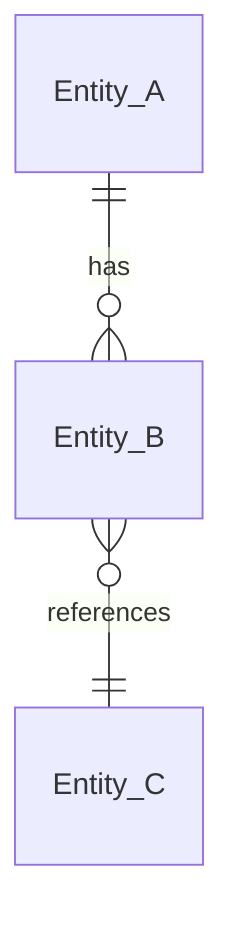

# Data model — {boundary_id}

> **Purpose:** Source of truth cho entities + schema + state machine mà `{boundary_id}` sở hữu.
> **Owner:** `intake:solution-architect`.
> **Audience:** `dev:backend` (implement DB layer), `review:backend`, `test-plan` (biết test data shape).
> **Out of scope:**
> - API endpoints → [`../api/api-{boundary_id}.md`](../api/)
> - Implementation pattern → [`../hld/hld-{boundary_id}.md`](../hld/)
> - UI rendering → [`../ux/ux-{boundary_id}.md`](../ux/)

---

## Boundary ownership

- **Aggregate / bounded context:** {tên context}
- **Boundary này là source of truth cho:** {Entity-A, Entity-B}
- **Đọc-only từ boundary khác:** (entity nào, lấy qua API nào — link `integrations/INTEG-*.md`)

## Entities & relationships



| Entity | Mô tả ngắn | Primary key |
|--------|------------|-------------|
| Entity_A | (1 dòng) | id (uuid) |
| Entity_B | | id (uuid) |

## Schema chi tiết

### Entity_A

| Field | Kiểu | Constraint | Mô tả |
|-------|------|-----------|-------|
| id | uuid | PK, NOT NULL | |
| name | varchar(100) | NOT NULL, UNIQUE | BR-1 (unique tên) |
| description | text | NULL | |
| status | enum | NOT NULL, default 'PENDING' | (xem state machine bên dưới) |
| created_at | timestamptz | NOT NULL, default now() | |
| updated_at | timestamptz | NOT NULL, default now() | |
| created_by | uuid | FK → user.id | |

**Indexes:**
- `idx_entity_a_name` ON `(name)` — UNIQUE
- `idx_entity_a_status_created` ON `(status, created_at DESC)` — cho list query

### Entity_B

(repeat pattern)

## State machine (entity có status)

> **OWNER:** Doc này. HLD/API chỉ reference, không định nghĩa lại.

### Entity_A — `status` lifecycle

```
   create
─────────► PENDING
              │
        approve / validate
              ▼
           ACTIVE ──── cancel ───► CANCELLED
              │
           complete
              ▼
           CLOSED
```

| State | Cho phép action | Forbidden |
|-------|----------------|-----------|
| PENDING | approve, cancel | complete |
| ACTIVE | complete, cancel | approve |
| CLOSED | — | tất cả |
| CANCELLED | — | tất cả |

**Transitions implemented at:** `domain/entity-a-service.{ext}` (xem [HLD](../hld/))

## Migration approach

- **Tool:** (alembic / flyway / liquibase / prisma-migrate / ...)
- **Strategy:** (forward-only / reversible / squash khi wave end)
- **Seed data:** `services/{prefix}-{boundary_id}/seed/` (dev only)
- **Breaking change rule:** thêm column NULLABLE trước → backfill → enforce NOT NULL ở migration tiếp

## Reference

- API mapping (endpoint → entity): [`../api/api-{boundary_id}.md`](../api/)
- Architecture pattern: [`../hld/hld-{boundary_id}.md`](../hld/)
- FEAT business rules: [`../feat/`](../feat/)
