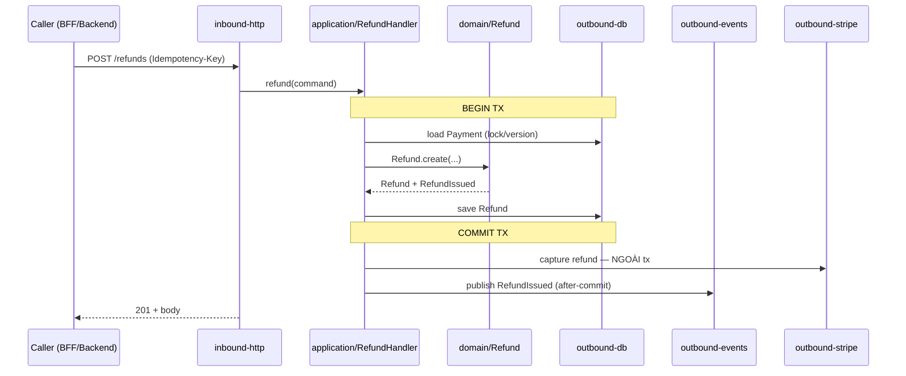

# HLD — `{{boundary}}` ({{kind}})

> Điền NGẮN GỌN: ưu tiên bảng/bullet, không văn xuôi thừa, không lặp. Doc này agent downstream đọc nhiều lần — tiết kiệm context.
> Source-of-truth cho dev: architectural style, layering, package, data flow, NFR, failure mode. Layout file cụ thể → skill `ref-{kind}-pattern`. Cross-boundary chỉ tham chiếu qua contract (`api/`, `events/`).

---

## 1. Mục tiêu + bối cảnh (C4 — System Context)

**Boundary này làm gì (1-2 câu):** {{vd. "Quản lý vòng đời refund: nhận yêu cầu, gọi provider, ghi sổ, phát event."}}

**Capabilities (map về FEAT):**

| Capability | FEAT | Mô tả ngắn |
|---|---|---|
| {{Issue refund}} | `FEAT-{{...}}` | {{...}} |
| {{Query status}} | `FEAT-{{...}}` | {{...}} |

**C4 Context:**

```mermaid
flowchart LR
  subgraph external[Bên ngoài]
    Provider[{{Stripe}}]
  end
  Upstream[{{caller: BFF/boundary khác}}] -->|REST api-{{boundary}}| THIS[{{boundary}}<br/>kind={{kind}}]
  THIS -->|event {{EventName}}| Downstream[{{consumer}}]
  THIS -->|HTTP| Provider
  THIS -->|R/W| DB[({{Postgres schema {{boundary}}}})]
  THIS -->|cache/idem| Cache[({{Redis}})]
```

**Out of scope:** {{vd. "Không xử lý chargeback (boundary dispute lo)."}}

---

## 2. Architectural style + driver

| Aspect | Choice | Driver | ADR |
|---|---|---|---|
| Style | {{Hexagonal / Layered / Onion}} | {{...}} | `ADR-{{boundary}}-{{NNN}}` |
| Inbound | {{REST / GraphQL / gRPC}} | {{...}} | — |
| Outbound | {{REST + Event-driven}} | {{...}} | — |
| State mgmt | {{Stateless+DB / CQRS / Event Sourcing}} | {{...}} | — |
| Concurrency | {{Optimistic (version) / Pessimistic / MVCC}} | {{...}} | `ADR-{{boundary}}-{{NNN}}` |
| Consistency | {{Strong trong boundary; eventual cross-boundary}} | {{...}} | — |

> Single-repo: KHÔNG fullstack boundary (P1). Quyết định lớn phải có ADR backing (P4).

---

## 3. Layering + dependency direction (Arch-Principles §3.1)

> Backend: hexagonal. FE thay bằng `app/ → features/ → shared/ → services/` (§3.2).

```
infra/inbound   (HTTP controller, event consumer, scheduler)
      ▼
application     (use-case, command/query handler, tx boundary)
      ▼
domain          (entities, VO, domain events/services — PURE, no framework)
      ▲
infra/outbound  (DB adapter, event publisher, external HTTP client)
```

**Dependency rules (verify ở `/review-dev` + ArchUnit):**
- `domain/` KHÔNG depend `infra/`|`application/` — pure, test không cần Spring.
- `application/` orchestrate + mở tx; KHÔNG SQL/HTTP detail; KHÔNG business rule chi tiết (rule ở `domain/`).
- Outbound integration qua adapter (port ở domain/application, impl ở infra/outbound). Inbound+outbound thay được không phá application+domain.

---

## 4. Module / package map

> Path = `services/{{prefix}}-{{boundary}}/` (owned_paths trong MATRIX). Layout chi tiết → skill `ref-{kind}-pattern`.

| Module | Path (dưới service root) | Responsibility | Depends on |
|---|---|---|---|
| `inbound-http` | `.../inbound/http/` | REST controller, validation, map DTO↔command | application |
| `inbound-events` | `.../inbound/events/` | Event consumer, idempotent dispatch | application |
| `application` | `.../application/` | Use-case handler, tx boundary, orchestration | domain, ports |
| `domain` | `.../domain/` | Entity, VO, domain event/service, port interface | (none) |
| `outbound-db` | `.../outbound/db/` | Repository impl, ORM mapping | domain (port) |
| `outbound-events` | `.../outbound/events/` | Event publisher (after-commit) | domain (port) |
| `outbound-{{provider}}` | `.../outbound/{{provider}}/` | External client + ACL | domain (port) |

---

## 5. Data flow (per capability)

> 1 sequence diagram / capability quan trọng. Rõ tx boundary + điểm gọi external (ngoài tx).

### 5.1 {{Capability-1, e.g. "Issue refund"}}



**Edge/error path (≥1):** {{vd. "Provider timeout sau commit → Refund PENDING_CAPTURE; reconciliation retry; consumer thấy event chỉ sau capture ok."}}

### 5.2 {{Capability-2}}
{{Same structure}}

---

## 6. Transactional boundaries + consistency

| Operation | Tx scope | Isolation | Ngoài tx (external/async) | Consistency cross-boundary |
|---|---|---|---|---|
| {{Issue refund}} | save Refund | {{Read Committed}} | provider capture, event publish | eventual (qua event) |

**Invariants:**
- Gọi external PHẢI ngoài DB tx (tránh giữ tx chờ network); compensating action nếu fail post-commit.
- Event publish **after-commit** (outbox); không publish nếu rollback.
- Cross-boundary KHÔNG distributed tx — saga / eventual + idempotent consumer.

**Saga / compensation (nếu flow nhiều bước cross-boundary):**

| Bước | Action | Compensation nếu bước sau fail |
|---|---|---|
| 1 | {{reserve}} | {{release reservation}} |
| 2 | {{charge}} | {{refund charge}} |

---

## 7. Non-functional requirements (NFR — refine từ PROJECT.md, KHÔNG lỏng hơn)

| Attribute | Target | Mechanism | Verify ở |
|---|---|---|---|
| Latency p99 (inbound) | {{< 200ms}} | {{pool, index, no N+1}} | perf TC |
| Latency p99 (gồm external) | {{< 500ms}} | {{async event, circuit breaker}} | perf TC |
| Throughput | {{1000 req/s peak}} | {{horizontal scale stateless}} | load test |
| Availability | {{99.5%}} | {{healthcheck, graceful degradation}} | infra |
| Durability | {{no data loss on crash}} | {{commit trước ack, outbox}} | resilience TC |

---

## 8. Persistence

| Store | Purpose | Schema / keyspace | Owner layer |
|---|---|---|---|
| {{Postgres}} schema `{{boundary}}` | Primary OLTP | `db/migrations/V__*.sql` | outbound-db |
| {{Redis}} `{{boundary}}:*` | Cache + idempotency | (key pattern §10) | application |

**Migration:** forward-only, no destructive DROP cùng wave (expand→migrate→contract). 1 file `V{n}__*.sql`, không sửa migration đã merge.
**Schema chi tiết:** → `data-model/data-model-{{boundary}}.md`. **Cross-boundary KHÔNG FK** — link bằng id, join app-layer (P1/P5).

---

## 9. Contracts — inbound + event + integration (high-level)

> Chỉ list quan hệ. Schema chi tiết ở contract artifact tương ứng.

**Inbound API (mình expose):** → `api/api-{{boundary}}.md`

| Endpoint (essence) | Capability | Consumer |
|---|---|---|
| `POST /{{...}}` | {{Issue refund}} | {{BFF/boundary-x}} |

**Events (mình phát):** → `events/{{boundary}}-events.md`

| Event | Produced by | Trigger | Subscribers | Delivery |
|---|---|---|---|---|
| `{{EventName-1}}` | `application/{{Handler}}` | {{after refund committed}} | {{boundary-2,3}} | at-least-once, idempotent |

**External integrations (mình gọi):** → `integrations/INTEG-EXT-{{name}}.md`

| Provider | Purpose | Sync/Async | Failure handling |
|---|---|---|---|
| {{Stripe}} | Payment capture | Sync HTTP | retry 3× exp; circuit breaker sau 5 fail |

**Common error envelope:** chuẩn chung (`ADR-platform-api-error-convention`) — 400/401/403/404/409/429/500. Domain code ở `api/api-{{boundary}}.md`.

---

## 10. Security (boundary-specific)

| Concern | Mechanism | ADR |
|---|---|---|
| AuthN | {{JWT verify; validate iss/aud/exp}} | `ADR-platform-auth` |
| AuthZ | {{RBAC tại application entry; deny-by-default}} | — |
| Multi-tenant | {{tenant_id mọi query; enforce qua repository wrapper}} | — |
| Secrets | {{Vault/env-mount, không hardcode}} | — |
| Idempotency | {{Idempotency-Key → store 24h Redis; replay trả kết quả cũ}} | `ADR-{{boundary}}-{{NNN}}` |
| Input validation | {{validate ở inbound, reject trước application}} | — |
| PII | {{field nào PII, mask log, encrypt at-rest nếu cần}} | — |

---

## 11. Observability

| Signal | What | Where |
|---|---|---|
| Logs | JSON, `correlation_id`, `tenant_id`, no PII raw | inbound + outbound |
| Metrics | RED per endpoint; business KPI ({{refund volume}}) | exporter |
| Traces | OTel span per use-case, propagate header cross-boundary | mọi layer |
| Audit | Security ops (auth fail, refund, admin override) | audit log riêng |
| Alerts | {{p99 > target, error-rate > X%, DLT > N}} | — |

Convention (log schema / metric naming / trace header) chốt ở ADR observability.

---

## 12. Failure modes + resilience

| Mode | Detection | Impact | Mitigation | Recovery |
|---|---|---|---|---|
| DB primary down | healthcheck fail | write fail | fail-fast 503 | failover; replay outbox |
| Provider timeout | timeout/circuit-open | refund PENDING | retry queue + circuit breaker | reconciliation job |
| Event bus down | publish fail | consumer chậm | outbox giữ event | replay khi bus up |
| Poison message | consume fail lặp | consumer kẹt | retry N → DLT | manual triage DLT |

**Degradation:** {{vd. "Provider down → nhận yêu cầu PENDING, không block user; capture sau."}}

---

## 13. Scaling assumptions

| Dimension | Assumption | Mechanism khi vượt | Trigger scale |
|---|---|---|---|
| Throughput | {{1000 req/s}} | thêm instance (stateless) | {{CPU > 70%}} |
| Data volume | {{N rows/table}} | partition theo tháng | {{table > X rows}} |
| Connection | {{pool M}} | tăng pool / read-replica | {{pool saturation}} |

---

## 14. ADRs index (boundary này)

| ADR-ID | Title | Status | Quyết định gì |
|---|---|---|---|
| `ADR-{{boundary}}-001` | {{Title}} | ACCEPTED | {{...}} |

Chi tiết: `adr/ADR-{{boundary}}-*.md`. Quyết định mới khi code → tạo ADR mới (P4) + cập nhật bảng.

---

## 15. Open questions / risks

| Câu hỏi / rủi ro | Ảnh hưởng | Owner | Hạn quyết |
|---|---|---|---|
| [ ] {{provider rate-limit chưa rõ}} | {{chặn throughput}} | {{@owner}} | {{Wave-N}} |

---

## 16. References

- Charter: `docs/discovery/boundaries/{{boundary}}/CHARTER.md` · Project: `PROJECT.md` · Principles: `ARCHITECTURE-PRINCIPLES.md`
- Data model: `data-model/data-model-{{boundary}}.md` · API: `api/api-{{boundary}}.md` · Events: `events/{{boundary}}-events.md` · Integrations: `integrations/INTEG-EXT-{{name}}.md`
- KG: `knowledge-base/{{boundary}}.knowledge-graph.yaml` · Pattern: skill `ref-{kind}-pattern`

---

## 17. Change log

| Date | Version | Author | CR/ADR | Description |
|---|---|---|---|---|
| {{DATE}} | 1 | {{Author}} | — | Initial HLD |
